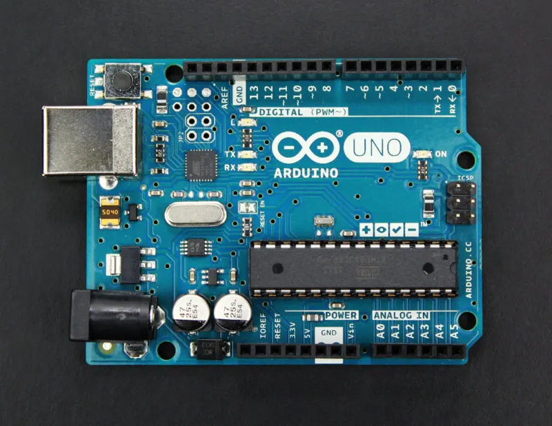
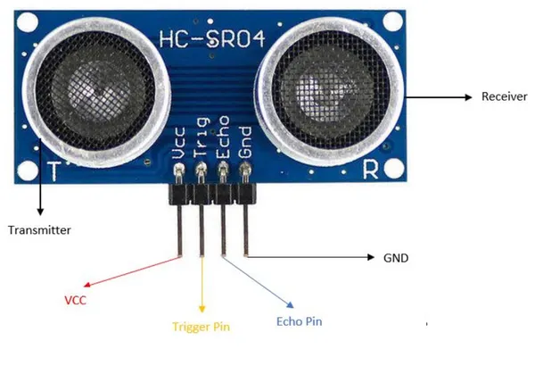

# Hardware Components

The system uses an Arduino Uno as the central controller, two ultrasonic sensors for distance measurement, and visual/audible indicators to warn drivers. All components are connected to the Arduino and powered via USB.

---

## 1. Arduino Uno
- **Role**: Main microcontroller. Reads sensor data, computes speed and risk level, and controls LEDs and buzzers.
- **Features**: ATmega328P, 14 digital I/O pins, 6 analog inputs, 16 MHz clock.

## 2. HC‑SR04 Ultrasonic Sensors (x2)
- **Role**: Measure distance to vehicles in front of each sensor.
- **Specifications**:
  - Operating voltage: 5V DC
  - Range: 2 cm – 400 cm
  - Accuracy: ±3 mm
- **Connections**:
  - `Trig` and `Echo` pins connected to digital I/O pins on Arduino.
  - VCC (5V) and GND.

## 3. LEDs (Red & Green, x2 each)
- **Role**: Provide visual warnings.
  - **Green**: Safe (riskLevel = 0)
  - **Red**: Danger (riskLevel = 1 or 2)
- **Wiring**: Anode through a 220 Ω resistor to Arduino digital pin; cathode to GND.

## 4. Buzzers (Passive or Active, x2)
- **Role**: Emit audible alerts when a vehicle is detected (riskLevel ≥ 1).
- **Wiring**: Positive to digital pin, negative to GND.

## 5. Power Supply
- **Source**: USB cable connected to a computer or a 5V power adapter.
- **Current**: Arduino Uno draws ~50 mA; sensors and LEDs add <200 mA total.

---

## Wiring Summary

| Component       | Pin (Arduino) |
|-----------------|---------------|
| Sensor A Trig   | 2             |
| Sensor A Echo   | 3             |
| Sensor B Trig   | 7             |
| Sensor B Echo   | 8             |
| Red LED A       | 4             |
| Green LED A     | 5             |
| Buzzer A        | 6             |
| Red LED B       | 9             |
| Green LED B     | 10            |
| Buzzer B        | 11            |

*All GND lines are connected to Arduino GND.*

---

## How It Works

1. **Distance Measurement**:  
   Each HC‑SR04 emits an ultrasonic pulse and measures the echo time. The Arduino converts the time to distance (cm) using: distance = (duration * 0.034) / 2

2. **Speed Calculation**:  
Speed is computed from successive distance readings: speed = (previous_distance - current_distance) / time_interval. A positive speed indicates the vehicle is approaching.

3. **Risk Level Determination**:
- **High (2)**: Both sensors detect a vehicle **and** the average speed > 2 cm/s (to avoid noise) **and** the distance difference is < 20 cm.
- **Medium (1)**: Either sensor detects a vehicle (or both with low speed).
- **Safe (0)**: No vehicle detected.

4. **Alerts**:
- **Green LEDs** on when riskLevel = 0.
- **Red LEDs** and **buzzers** activate according to the risk logic (e.g., both sides high risk → both red and buzzers; one side medium → opposite side red + buzzer).

5. **Data Output**:  
The Arduino prints a CSV line every 200 ms over the serial port. This data is read by `live_pipeline.py` for storage and further processing.

---

## Conceptual Framework

## Conclusion

This hardware setup provides a robust, low‑cost platform for real‑time collision risk detection.
